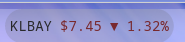
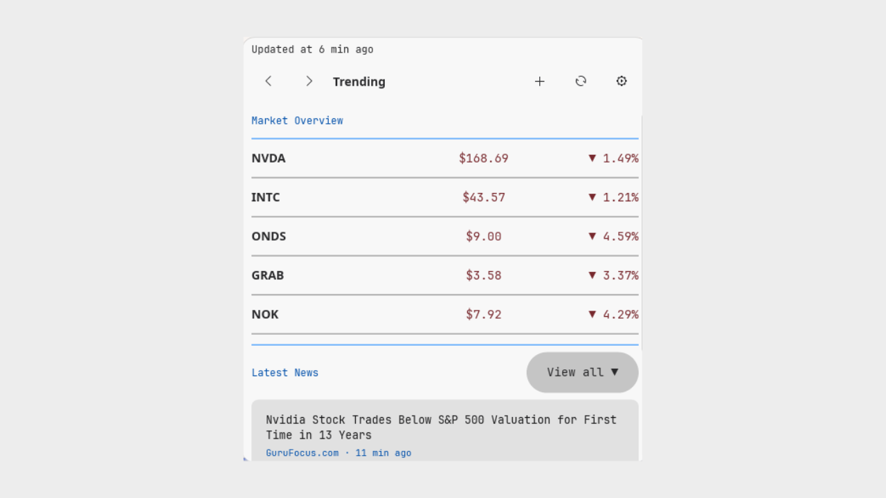
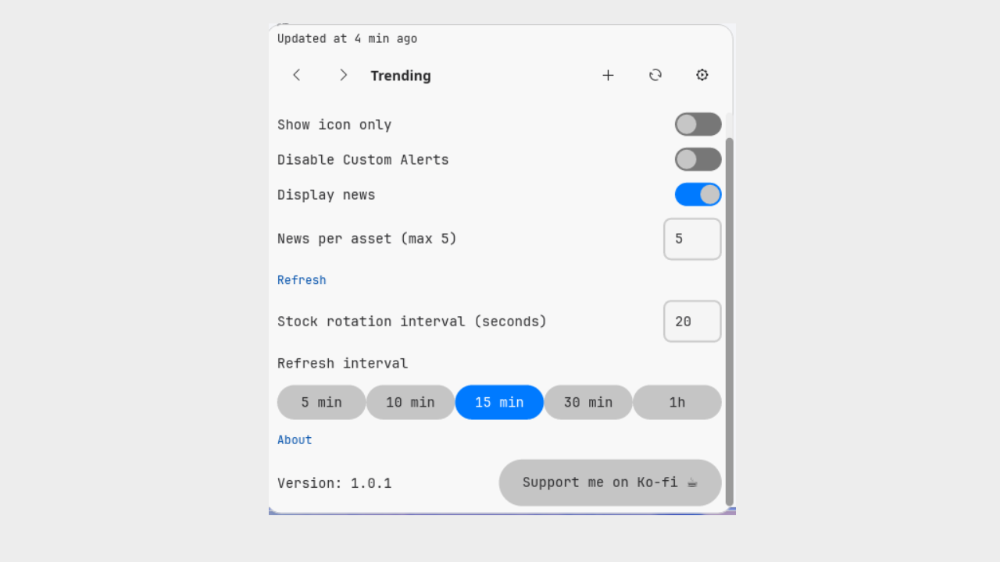
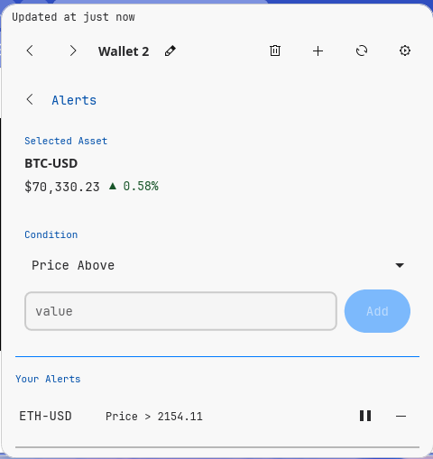

# Cosmic Marketwatch

Real-time stock market ticker for the COSMIC desktop

## Screenshots

| Panel | Wallet | Settings | Alerts |
|-------|--------|----------|--------|
|  |  |  |  |

## Features

- Real-time market data from Yahoo Finance (no API key required)
- Current price and percentage variation displayed in panel
- Automatic rotation between multiple assets
- Detailed popup with tabbed interface:
  - **Overview tab**: trending and most active assets with latest news
  - **Wallet tab**: track your own portfolio of up to 10 assets
  - **Alerts tab**: price and variation alerts with notifications
  - **Settings tab**: all configuration options
- Up to 10 custom wallets with up to 10 assets each
- Price alerts:
  - Above or below price
  - Variation thresholds
  - Turns positive or negative
- Desktop notifications when alert conditions are met
- Latest news per asset from Yahoo Finance
- Support for multiple currencies:
  USD, BRL, EUR, GBP, JPY, CHF, CAD, AUD, CNY, INR
- Configurable refresh interval and stock rotation speed
- Persistent wallet and alert configuration

## Planned Features

### Advanced Portfolio Tracking

- Allow users to define how many shares they own per asset
- Automatically calculate:
  - Current value per asset (quantity × current price)
  - Profit/loss per asset
- Display individual asset performance:
  - Absolute value
  - Percentage change
- Display total portfolio value
- Display total portfolio performance:
  - Total gain/loss
  - Overall percentage change

### Real-Time Portfolio Updates

- Portfolio updates dynamically with market prices
- Show gain or loss based on price changes
- Optional comparisons:
  - Since last refresh
  - Since market open

### Portfolio Breakdown

- Show allocation per asset (percentage of portfolio)
- Possible future visualization (chart)

### Insights

- Highlight best and worst performing assets
- Simple summaries of portfolio performance

### Cost Basis

- Allow input of average buy price
- Calculate real profit/loss based on cost basis

### Portfolio Alerts

- Alerts based on total portfolio value
- Notifications for reaching profit or loss thresholds

## Installation

A [justfile](./justfile) is included by default for the
[casey/just][just] command runner.

- `just` builds the application with the default
  `just build-release` recipe
- `just run` builds and runs the application
- `just install` installs the project into the system
- `just vendor` creates a vendored tarball
- `just build-vendored` compiles with vendored dependencies
- `just check` runs clippy to check for linter warnings
- `just check-json` can be used by IDEs that support LSP

## Translators

[Fluent][fluent] is used for localization of the software.

Translation files are in the [i18n directory](./i18n).

New translations may copy the English localization and rename
`en` to the desired ISO 639-1 language code.

## Packaging

If packaging for a Linux distribution:

- Vendor dependencies locally with the `vendor` rule
- Build with vendored sources using `build-vendored`

Example:

```sh
just vendor
just build-vendored
just rootdir=debian/cosmic-ext-marketwatch prefix=/usr install
```

## Developers

Install [rustup][rustup] and configure your editor to use
[rust-analyzer][rust-analyzer].

[fluent]: https://projectfluent.org/
[just]: https://github.com/casey/just
[rustup]: https://rustup.rs/
[rust-analyzer]: https://rust-analyzer.github.io/

## Configuration

Click the applet to open the popup and go to Settings:

- Toggle icon-only mode
- Enable or disable news per asset
- Set number of news items (1–5)
- Set stock rotation interval (seconds)
- Set refresh interval:
  5, 10, 15, 30 minutes or 1 hour
- Enable or disable price alert notifications

Settings are saved automatically and persist across sessions.

## Data Source

Market data is retrieved from Yahoo Finance public endpoints.

This project is not affiliated with, endorsed by, or sponsored
by Yahoo Inc.

## License

GPL-3.0-only - See [LICENSE](./LICENSE)

### Author

- Paulo Rosado
